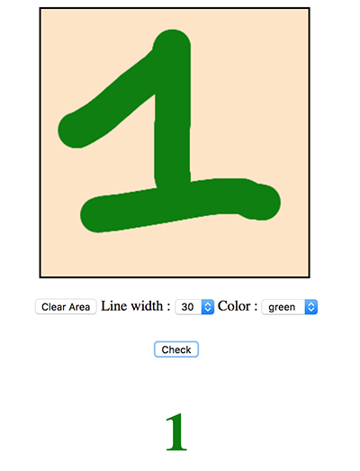

# MNIST Classification Application

#  Introduction
We trained a Convolutional Neuron Network on **MNIST** dataset by using Keras framework with Tensorflow backend and get an accuracy of **99.34%**. 

This repository includes a Python script which allows you reproduce the training process. You are free to adjust the network architecture and training parameters to make your own model.
In addition, we also create a web app using Flask framework to serve the trained model. This web app allows you to draw digit number from 0 to 9 and displays the predicted digit of your drawing.

# How to use it

Before using this source code, you need to install tools like numpy, tensorflow, keras, pillow and flask.

Use show re-train the model:

    mnist_with_neural_network.ipynb

After finishing the training process, put the model (***mnist_cnn.h5***) in ***static*** folder of Flask app and run the following commands to start the app:

    export FLASK_APP=app.py
    python -m flask run

Using any web browser to access:  http://127.0.0.1:5000/
